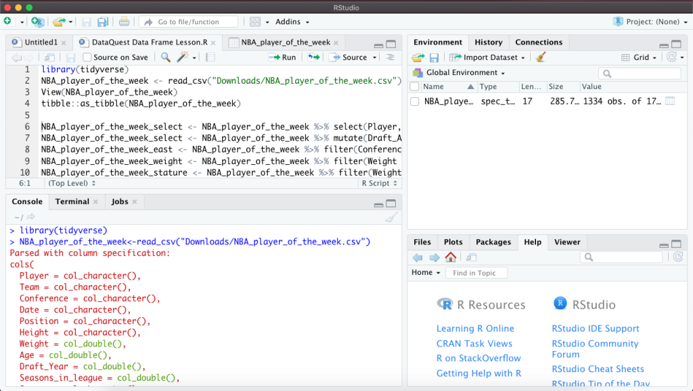

```{r setup, include=FALSE}
knitr::opts_chunk$set(echo = FALSE)
```

In honor of the RStudio Conference that took place in San Francisco last week, I wanted to talk a bit about **RStudio**, the IDE that I’m using to practice R. This is also a lesson in the Data Analyst in R track called, Guided Project: Install RStudio.

I had a bit of a struggle installing R and R Studio. Initially, I had [Anaconda](https://www.anaconda.com/products/individual) installed. Anaconda is a Python package manager that comes preinstalled with a lot of Python libraries that are useful for data science. It also comes with some preinstalled applications, one of which is R Studio. I first installed R using [this website](https://www.r-project.org/), next I installed Anaconda, then I installed [RStudio](https://rstudio.com/products/rstudio/). I tried to use RStudio in this way and it did not work for me. I tried typing different expressions into the RStudio console and it did not work. I kept installing and reinstalling R and Anaconda to no avail.

One day, I decided to uninstall R, Anaconda, R Studio. I decided that instead of trying to install R Studio through Anaconda, I would install RStudio directly through its website. Besides, I did not see the point of reinstalling Anaconda to only use one app. I first went to the R website and downloaded R. I followed the instructions and tested R in the R console to make sure it worked. I then went to the RStudio website and downloaded RStudio. I opened R Studio and tried to type expressions in the R Studio and low and behold it worked!

Now that I have RStudio working and been using it for a few weeks, I wanted to share some of my favorite features so far.



First off, I really enjoy the workspace being divided into four quadrants. It allows me to see everything at once. If I wanted to minimize one of the quadrants, I could do that too. It looks to be very flexible in that regard.

Another feature I like is being able to import a data set. In my previous post, I touched on one way to import a data set. Another way be would be to go to the **Environment** tab and click on Import Dataset. I used the readr option because it uses functions that I’ve been taught in this Data Analyst track.

The Environment tab shows you objects that have been stored in your global environment. I could always delete these objects if there are too many and they begin to cause confusion.

The last feature I wanted to talk about is the **History** tab which is a saved record of every single command that I typed into the console. I really like this feature because it saves me from retyping the same commands. Even if I exit out of RStudio, the history is still there.

This is just the beginning of my use of RStudio. I have yet to use RStudio to its full potential. I’m already excited about using the plots tab and connecting with databases. I can’t wait to use it more and discover more features.

This lesson marks the end of the Intro to Programming in R course in the Data Analyst in R track. I’m moving on to Intermediate R Programming! Until next time…