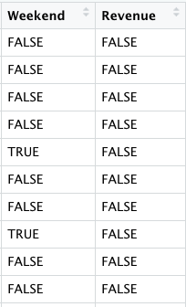
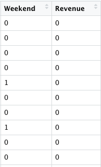
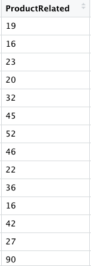
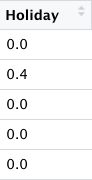

<style>
    pre code {
      white-space: pre-wrap;
    }
</style>

```{r setup, include=FALSE}
knitr::opts_chunk$set(echo = FALSE)
```

I have now reached the Data Cleaning in R section of DataQuest’s Data Analyst in R track. I had some difficulty finding a messy data set to clean. I decided to practice cleaning two datasets.

I’ll first discuss the first data set which comes from UCI Machine Learning Repository. In the repository, I found the [Purchasing Intention Data Set](https://archive.ics.uci.edu/ml/datasets/Online+Shoppers+Purchasing+Intention+Dataset). This data set explores the intentions of online shoppers using metrics like Bounce Rate and Traffic Type.

The first thing I wanted to do was to convert the columns Weekend and Revenue from logical(TRUE/FALSE) columns to numeric columns. There are a few ways to do this as shown in the screenshot below.

```{r include=FALSE}
library(tidyverse)
online_shoppers_intention <- read_csv('/Users/User/datascidani2/_posts/2020-05-29-data-cleaning-with-r/online_shoppers_intention.csv')
```

```{r echo=TRUE}
# Converting a single column to numeric:
online_shoppers_number <- online_shoppers_intention %>%
  mutate(`Weekend` = as.numeric(`Weekend`))
```

```{r echo=TRUE}
# Converting multiple columns to numeric with column names:
online_shoppers_number <- online_shoppers_intention %>%
  mutate_at(vars(Weekend, Revenue), as.numeric)
```

```{r echo=TRUE}
# Converting multiple columns to numeric with column indexes:
online_shoppers_number <- online_shoppers_intention %>%
  mutate_at((17:18), as.numeric)
```

I decided to use the second script to convert the Weekend and Revenue columns to numeric columns. The first photo shown is before I converted the columns to numeric and the second photo shows the columns after I converted them to numeric columns.





The next thing I decided to do was to filter the data frame so that values for the ProductRelated column are more than 15. The ProductRelated column refers to products pages of a shopping site. I filtered the data using the script shown below.

```{r echo=TRUE, results='hide'}
online_shoppers_number <-online_shoppers_number %>%
  filter(ProductRelated > 15)
```

This is what the column looked like after I filtered it:



I then decided to group the data by Month and Visitor Type and sum up the columns using Informational and Informational Duration columns.

The results are shown below.

```{r echo=TRUE}
online_shoppers_group <- online_shoppers_number %>%
  group_by(`Month`, `VisitorType`)
```

```{r echo=TRUE}
online_shoppers_informational <- online_shoppers_group %>%
  mutate(`Informational_Total` = `Informational` + `Informational_Duration`)

online_shoppers_informational
```

Next, I wanted to filter and select variables from a data frame.

```{r echo=TRUE}
online_shoppers_select <- online_shoppers_informational %>%
  filter(Region == "3"  & Browser == "2") %>%
  select(`Month`, `VisitorType`, `OperatingSystems`, `Browser`, `Region`)
online_shoppers_select
```

I decided to change the name of the Special Day column to Holiday using the rename function.

```{r echo=TRUE, results='hide'}
online_shoppers_informational <- online_shoppers_informational %>%
  rename(Holiday = SpecialDay)
```

This is what the SpecialDay column looked like after I changed its name to Holiday.



Lastly with this data frame, I decided to look for duplicate values.

```{r echo=TRUE}
duplicated(online_shoppers_select)[1:10]
```

The problem with this approach is the output of duplicated() is a vector and I’d have to search for the values that are TRUE. I would have to index the vector to get the values that are duplicates. This method is not ideal, especially if I’m working with multiple data frames.

## Another Method of Finding Duplicates

There is another way to look for duplicated values. I can combine the duplicated() function with the purrr functionals and dplyr to look for duplicated values.

For this example, I’ll use two data frames I created myself.

The first step is to create a list of the data frames so I can use a functional to perform the same operation on each data frame.

```{r echo=TRUE, results='hide'}
baby_traffic <- data.frame(Browser = c("Windows", "macOS", "Linux", "Android", "iOS"),
                    Region = c("North America", "South America", "Africa", "Asia", "South America"),
                    TrafficType = c(1, 1, 3, 4, 4))


men_traffic <- data.frame(Browser = c("Windows", "macOS", "Linux", "Android", "iOS"),
                         Region = c("Africa", "South America", "Africa", "Asia", "Europe"),
                         TrafficType = c(0, 2, 1, 3, 0))

```

```{r echo=TRUE, results='hide'}
traffic <-list(baby_traffic, men_traffic)
```

I’ll then use the map() functional and mutate() function to create a new column with the logical output of duplicated(). This will allow me to filter the data frame to return rows where the values of duplicated column are TRUE. When I call dup_traffic, you can see here that duplicates have been identified in the TrafficType column.

```{r echo=TRUE}
dup_traffic<- traffic %>%
  map(mutate, is_dup = duplicated(TrafficType))
dup_traffic
```

I have to admit this was a pretty difficult section but I’m glad I’m learning it! That’s all for Data Cleaning for now. Until next time…