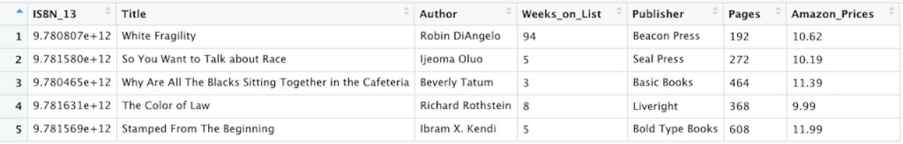
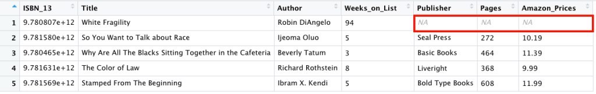
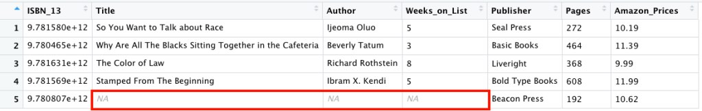
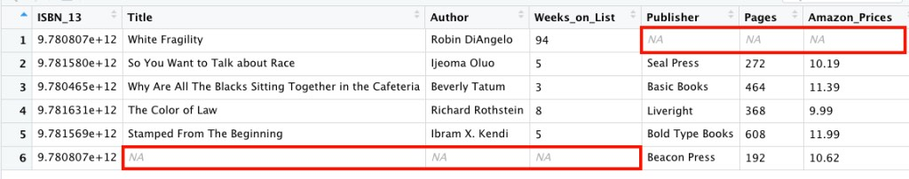

<style>
    pre code {
      white-space: pre-wrap;
    }
</style>

```{r setup, include=FALSE}
knitr::opts_chunk$set(echo = FALSE)
```

Hello everyone! Long time no see. I’m happy to be back with another post with this post focusing on what I learned in Dataquest’s String Manipulation and Relational Data lesson. I thought I switch up these posts a bit. Instead of sharing every single thing I’ve learned in these lessons, I have decided to focus on functions and concepts that stick out to me.

In this lesson I learned about manipulating strings to create new variables and relational data using joins and keys. This post will focus on two new concepts I learned: the **parse_number()** function and the types of joins that are used to combine data frames.

## Parse_number()

The *parse_number()* function is part of the readr package and it drops any non-numeric characters before or after the first number. The example below shows that every non-numeric character was dropped to parse out the number 87.35.

```{r echo=TRUE, results='hide'}
library(tidyverse)
library(knitr)
library(jpeg)
```

```{r echo=TRUE}
parse_number("This shirt cost $87.35, that is so expensive!")
```

What happens when I have more than one numeric character I want to extract? This is where regex, better known as regular expressions come in. However, I’ll probably cover more regular expression topics in a future post.

## Joins

The biggest takeaway from this lesson had to with joins. Recall from a previous post that to combine vectors and matrices, I used rbind() to combine by rows and cbind() to combine by columns. When you combine vectors and matrices, the values of the rows and columns are combined based on their position.

If I wanted to join data frames, however, I would join the columns together based on matching values of a variable. A key is a variable that is used to combine data frames. We use the dplyr package to work with data frames. The dplyr functions used to combine tables are for executing mutating joins. Mutating joins add new variables to a data frame based on matching values in another data frame. The concept of having multiple tables containing data that you are interested in relationships between is referred to as relational data.

When I learned of joins in R, I was excited because it immediately reminded me of learning of joins in Tableau. I’ve also heard of joins in SQL so I thought this topic would be very important for me to learn, understand and eventually share. Enough of me yapping, let’s get to the joins!

## Inner Join

Inner joins match pairs of variables in two data frames when their values of the key are the same. Any rows with unmatched keys are dropped. Let’s look at the example below.

A few weeks back, I decided to look up some information about the top five paperback nonfiction books on the New York Times’ bestseller list. From my research, I created the two data frames below. The first data frame is referred to as **paperback_nonfiction**. The second data frame is referred to as **publisher_info**.

```{r echo=TRUE}
paperback_nonfiction <- data.frame("ISBN_13" = c(9780807047416, 9781580058827, 9780465060869, 9781631494536, 9781568585987),
                                   "Title" = c("White Fragility", "So You Want to Talk about Race", "Why Are All The Blacks Sitting Together in the Cafeteria", "The Color of Law", "Stamped From The Beginning"),
                                   "Author" = c("Robin DiAngelo", "Ijeoma Oluo", "Beverly Tatum", "Richard Rothstein", "Ibram X. Kendi"),
                                   "Weeks_on_List" = c(94, 5, 3, 8, 5))
```

```{r echo=TRUE}
publisher_info <- data.frame("Publisher" = c("Beacon Press", "Seal Press", "Basic Books", "Liveright", "Bold Type Books"),
                             "ISBN_13" = c(9780807047415, 9781580058827, 9780465060869, 9781631494536, 9781568585987),
                             "Pages" = c(192, 272, 464, 368, 608),
                             "Amazon_Prices" = c(10.62, 10.19, 11.39, 9.99, 11.99))
```

After creating the data frames, I decided to perform an inner join because I wanted to only include results that appeared in both data frames I’m joining. Using the code below, I joined the two data frames using the variable **ISBN_13** as my key.

As you can see, when I performed an inner join, it kept the rows that matched from the data frames. Notice that the first row of the **paperback_nonfiction** data frame and the first row of the **publisher_info** data frame were dropped because those two rows were not a match. The data frame below is referred to as **best_paperback_nonfiction**.

```{r echo=TRUE}
best_paperback_nonfiction <- paperback_nonfiction %>%
  inner_join(publisher_info, by = "ISBN_13")
```

```{r, out.width= "100%"}

```

## Outer Joins

Outer joins keep values that appear in at least one of the data frames you’re combining. Any missing values will be filled in with “NA”. There are three types of outer joins:

- left join
- right join
- full join

Let’s go over these in more detail.

### Left Join

A left join keeps all the values in the data frame to the left and drops the values from the data frame to the right that have no key match.

I used the code below to perform a left join on the paperback_nonfiction and publisher_info data frames I used before.

The result of the following code is that when the data frames are joined together, the values of the data frame on the right (the publisher_info data frame) are dropped.

```{r echo=TRUE}
best_paperback_nonfiction <- paperback_nonfiction %>%
  left_join(publisher_info, by = "ISBN_13")
```

```{r, out.width= "100%"}

```

### Right Join

A right join keeps values in the data frame to the right and drops the values from the data frame to the left that have no key match.

The result of the following code is that when the data frames are joined together, the values of the data frame on the left (the paperback_nonfiction data frame) are dropped.

```{r echo=TRUE}
best_paperback_nonfiction <- paperback_nonfiction %>%
  right_join(publisher_info, by = "ISBN_13")
```

```{r, out.width= "100%"}

```

## Full Join

A full join keeps all observations from the data frames you’re joining. Again when there is no key match, values are dropped.

The result of the following code is that when the data frames are joined together, the values of the data frame on the left (the paperback_nonfiction data frame) and the data frame on the right (the publisher_info data frame) are dropped since they are not a match.

```{r echo=TRUE}
best_paperback_nonfiction <- paperback_nonfiction %>%
  full_join(publisher_info, by = "ISBN_13")
```

```{r, out.width= "100%"}

```

Whew! Okay I know that was a lot but just wanted to share. The more I do these posts the better I understand these important R and programming concepts. Until next time…