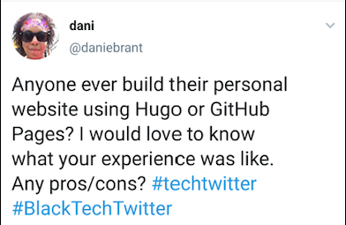

```{r setup, include=FALSE}
knitr::opts_chunk$set(echo = FALSE)
```

````{r include=FALSE}
library(knitr)
library(jpeg)
```

When I first decided to start my Data Sci Dani blog, I did a lot of research into website builders in an effort to find one that would be easiest to use. After doing much research, I decided on WordPress because I was most familiar with it, having previously blogged on the platform and used it for school. It was also cheaper than what I had previously used. 

WordPress was a great option for me for a while but I longed to cut costs further. At the time I was not working and with no money coming in, I knew that I wouldn't be able to keep it up for long. I remembered the very first website I made many years ago and I recalled that it was a lot less expensive than than using a CMS service. I was looking for a way to build a website that was simple and didn't have a lot of bells and whistles. 

I did some preliminary research and came across Hugo and Github Pages. I had heard a bit about Github Pages but not Hugo so I decided to take to Twitter: 

```{r, out.width= "60%"}

```

I got a few responses about Jekyll and Github Pages but it looked a bit too complex for me. Several folks suggested Hugo and Blogdown but I was overwhelmed by the number of themes to choose from. Then I recieved a reply by Shannon Pileggi better known as PipingHotData on Twitter. She shared a bit about her experience with blogdown before sharing that she now uses distill, with a link to the distill documentation. I had never heard of distill so I checked out the documentation. As I read the documentation, I had an aha moment. This was exactly what I was looking for. 

So one Saturday morning, I looked up distill on YouTube and came across this distill tutorial by Matt Crump:

[Blogging with R and Github Using Distill](https://www.youtube.com/watch?v=uLUqZp1kAWc)

I followed his video step-by-step and I was surprised by how easily and how quickly I was able to build a distill blog. 

The most time-consuming part of building the site at this point was bringing all my content from WordPress to this new distill site. I actually just copied and pasted my posts from WordPress to Distill(I'm sure there is an easier way to do this that I haven't figured out yet!).

There were a few hiccups along the way. Somehow I accidentially deleted the folder with all my distill website content from my computer. Fortunately, I had already uploaded everything to Github so I downloaded those files, deleted the repo and then created a new repo with the downloaded files. I then had issues resizing my images. I asked twitter about reszizing photos in R Markdown and was directed to this [article](http://zevross.com/blog/2017/06/19/tips-and-tricks-for-working-with-images-and-figures-in-r-markdown-documents/#our-examples-one-pre-existing-image-and-one-dynamically-generated-plot). I also had trouble publishing the site to [Netlify](https://www.netlify.com/), a free deployment service. It turns out that I had to change the output directory in the yaml file to "_site" before publishing the site. I found these blog posts by [Shamindra Shrotriya](https://www.shamindras.com/posts/2019-07-11-shrotriya2019distillpt1/) and [Thomas Mock](https://themockup.blog/posts/2020-08-01-building-a-blog-with-distill/) to be incredibly helpful. Additionally, I had to transfer my domain name away from WordPress to another domain provider. 

After all the hiccups, my website is finally up and running. I decided to use the [Tidymodels theme](https://rstudio.github.io/distill/blog.html?panelset=tidymodels#example-themes) by Desirée De Leon. There are a few things I want to work on:

1. How to set up an email subscription. I'd love for folks to recieve an email when I've published a new post. 
2. How to set up a gallery of featured/most recent posts.
3. How to implement Google Analytics on my site for tracking activity. 
4. The look of my site needs just a bit of tweaking. I want to to add a favicon, a logo, search bar, and maybe change the colors.

As you can see, the site is still a work in progress but I'm happy with how far the site has come. 

Until next time...


