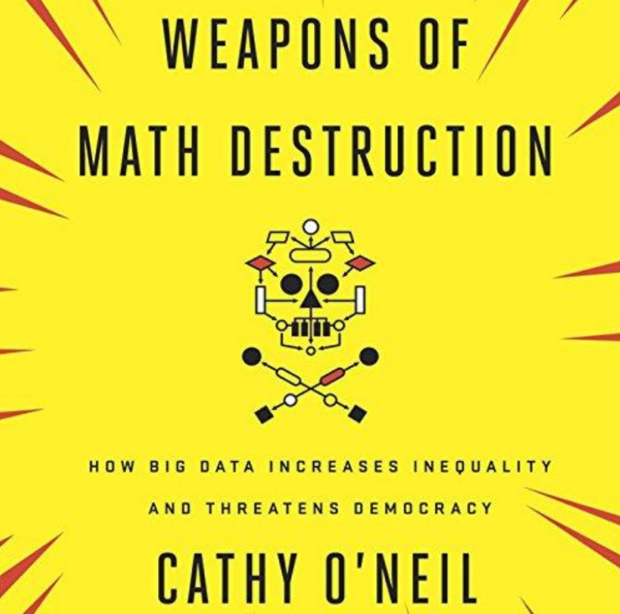

```{r setup, include=FALSE}
knitr::opts_chunk$set(echo = FALSE)

# Learn more about creating blogs with Distill at:
# https://rstudio.github.io/distill/blog.html

```

```{r include=FALSE}
library(knitr)
library(jpeg)
```

For the past several years, I’ve explored different career paths in tech. I’ve played around with web development but found that was not a good fit for me.  For a long time, I wanted to be a UX designer which later turned into UX writing. I spoke with people who worked in UX, attended meetups and different events that were UX focused. Many of the classes I took as part of my graduate program were design-focused.

Although I enjoyed learning UX, as I completed  my final projects for these classes, I came to the realization that this was not what I wanted to do as a career. This became even more clear after I failed to land a huge job opportunity. After my failed job interview, I began reevaluating my career interests and goals. Why was I interested in UX in the first place? Was it genuine interest or was I pursuing it because it looked cool? Why did I want to be in tech in the first place? After taking some time to explore the answers to these questions and more, it brought me back to data, a huge topic that has been of interest to me for many years.

My interest in data really started with data journalism. I didn’t want to be a data journalist, but I did and still do enjoy the work of people like Mona Chalabi and I follow publications like The Guardian, Five Thirty-Eight and The New York Times. Last year I took a course in my program called Big Data and Media. It was in this class that I learned about the potential of data and analytics. The class was given the assignment to choose from a list of links to articles or interviews about data and summarize it. I chose an NPR interview with Cathy O’Neil, author of Weapons of Math Destruction. In the interview, she talked about the dangers of relying on big data analytics to solve problems, using public education and recidivism as examples of areas where using big data analytics to solve problems has caused huge issues. After listening to the interview and watching her TED talk, I became really interested in learning more.

```{r, out.width= "60%"}

```

This summer, I took a Python for Data Science course and I purchased Cathy O’Neil’s book (both Kindle and Audible) which I’m currently reading. In December, I completed my final class for my grad program, Market Research for Media Managers which really helped cement my interest in data, particularly data in the media and entertainment industry. Through this course, I’ve learned about programmatic buying and addressability, projectability (who do the results represents and with what reliability), and much more. 

I am participating in the Data Executives Program where I am learning about different tools and exploring what interests me. In addition to Python, I’ve looked into learning R, Excel, SQL, and Tableau. I have since decided to learn R and SQL for now. I plan on attending meetups and different data-science focused events. I also plan to do more reading on data science-related topics. I recently purchased Charles Wheelan’s Naked Statistics and Data Science for the Layman by Annalyn Ng and Kenneth Soo. I am especially excited to dive into more books like Weapons of Math Destruction that address how negative bias has become embedded in our data. Algorithms of Oppression by Dr. Safiya Umoja Noble and Invisible Women by Caroline Criado Perez, to name a few, are books that are at the top of my list. In all, I am excited to learn more about data science and I look forward to where my interests will take me.


