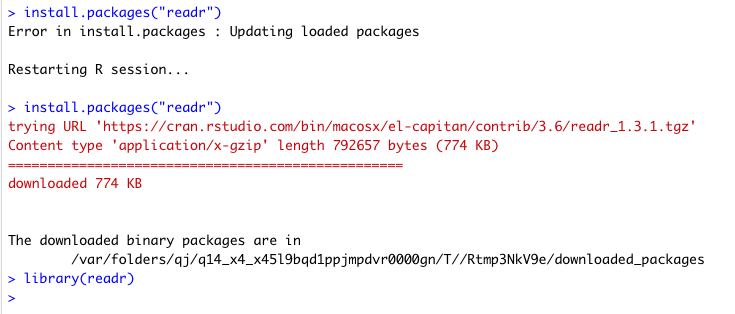
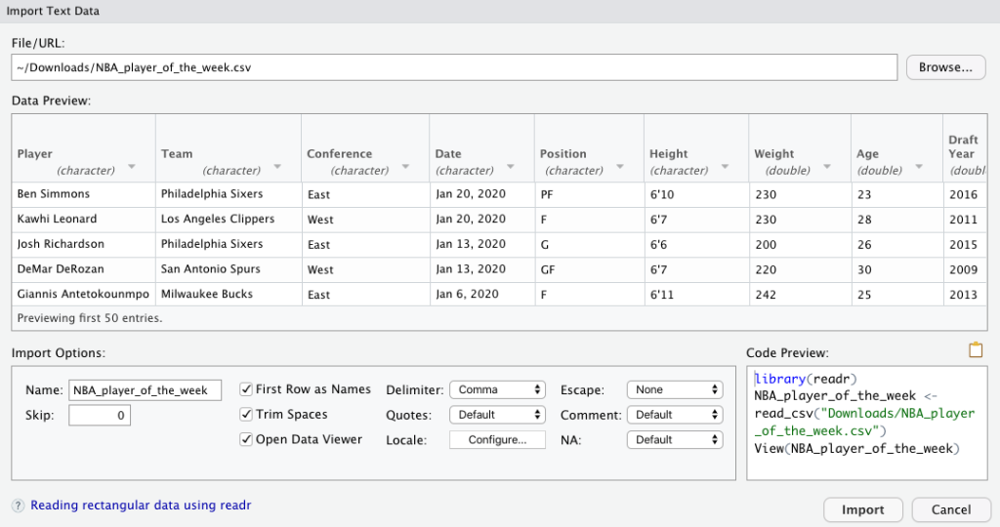
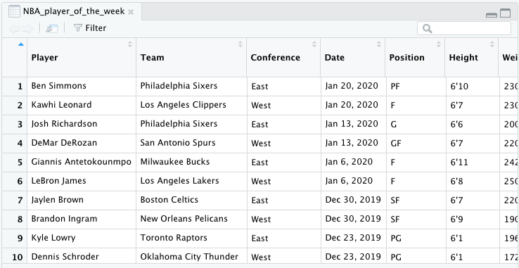
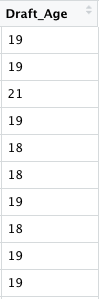

<style>
    pre code {
      white-space: pre-wrap;
    }
</style>

```{r setup, include=FALSE}
knitr::opts_chunk$set(echo = FALSE)

# Learn more about creating blogs with Distill at:
# https://rstudio.github.io/distill/blog.html

```

Basketball has been heavy on mind lately. One reason being the All the Smoke podcast that I listen to with Matt Barnes and Stephen Jackson every week. I’ve been listening to the podcast since day one. Another reason has been the recent passing of Kobe Bryant, his daughter Gianna and the seven other lives that were taken in that helicopter accident. When I think of Kobe, I think about my brother and the kids I went to school with. They would shout ‘KOBE’ anytime they threw something. 

Because of people like my brother, like those kids I went to school with, I decided to go with a basketball theme with this post. I wanted to shed light on some of the players that Kobe inspired and some that maybe inspired him. The data set that I will use for this blog post was posted on [Kaggle](https://www.kaggle.com/jacobbaruch/nba-player-of-the-week/data) by Jason Baruch. Baruch created the NBA Player of the Week data set that analyzes player of the week data from 1979-80 season to the present. I decided to download the csv and play around a bit. With that said, let’s get into data frames in R.

**Data frames** are a list of vectors of equal length. They can contain multiple data types and they are probably the most common data structure in R. Not only did I learn about data frames but I learned about some R packages that makes doing data science with data frames efficient.

## Installing and Loading Packages

The first thing I did as part of the DataQuest lesson was to install the **readr** package, which is part of the **tidyverse**. Readr is designed to improve data science workflow. DataQuest gives me a few ways that readr does this:

- **Speed:** Importing larger data files with readr functions is generally faster than using base R functions. By the way, base R is just the basic software that comes with the R programming language.
- **Code reproducibility:** While base R function behavior depends in part on your operating system and environment variables, this is not the case for readr. When you use readr to import files, code that works on your computer will work on someone else’s.
- **Consistency:** The readr package shares a common syntax and design philosophy with other tidyverse packages that we’ll introduce in upcoming courses.

After installing readr, I loaded the package using the **library** function. 



## Importing Data with R

RStudio (the IDE I’ve been using in my posts) has an option to import data. To do this I went to **File -> Import Dataset -> From Text(readr)**. This leads to a screen that prompts me type a file name or URL. However, I decided to click on **Browse** which leads me to import a document. When I imported my csv that I downloaded from Kaggle, this is what I get:



After I click import, my csv file is opened like this.



*Note:* The tidyverse is a collection of packages designed to make using R for data science more effective. In addition to readr, tidyverse includes dplyr which will be discussed later. Instead of installing each package, I installed tidyverse just as I did with readr example in the above screenshots.

```{r echo=TRUE}
library(tidyverse)

NBA_player_of_the_week <- read_csv('/Users/User/datascidani2/_posts/working_with_dataframes 01-30-20/NBA_player_of_the_week.csv')

```

```{r echo=TRUE}
View(NBA_player_of_the_week)
```

## Tibbles

To make the data easier to work with, I decided to get my data frame into a **tibble**. A tibble is the same as a data frame in base R. DataQuest mentions that they are two-dimensional data structures that store data of multiple types. They also have very important advantages: clarity, consistency and printing. You can type the name of a tibble and R will only print the first 10 rows.

```{r echo=TRUE}
tibble::as_tibble(NBA_player_of_the_week)
```

## Indexing Data Frames

For data frames, I can use indexing to return a specific, row, column or value. It’s pretty similar to indexing matrices. If I wanted to index the column “Team”, I could do this in a couple of ways:

By position :

```{r echo=TRUE}
NBA_player_of_the_week[, 2]
```

By column name:

```{r echo=TRUE}
NBA_player_of_the_week[, "Team"]
```

DataQuest also mentioned that I could use a **$** symbol to specify a column though when I tried this method R printed 1000 rows of data.


Here are some more examples of indexing data frames:

```{r echo=TRUE}
NBA_player_of_the_week$Team[2]
```

```{r echo=TRUE}
NBA_player_of_the_week[6,2]
```

```{r echo=TRUE}
NBA_player_of_the_week[6, ]
```

```{r echo=TRUE}
NBA_player_of_the_week[c(2:8), c("Player", "Pre_draft_Team")]
```

## Working With Data Frame Columns
I could simplify my data frame to contain only variables(the column names) that are relevant for my data analysis.

For example, I want to create a new data frame that includes the names of the players, their teams, characteristics(height, weight, age), draft year and how many seasons they’ve played in the league. I would use **dplyr**, a tidyverse package designed for analyzing data in data frames.

To use this package, I would install and load it just as I did with the readr package. The dplyr function **select()** allows me to create a new data frame with only the columns containing the variables I want to use for my analysis. I realized that I already have tidyverse installed so I loaded that before creating this new data frame.

```{r echo=TRUE}
NBA_player_of_the_week_select <- NBA_player_of_the_week %>% select(Player, Team, Position, Height, Weight, Age, Draft_Year, Seasons_in_league)

NBA_player_of_the_week_select
```

I could also create new variables and add them to my data frame as columns using another dplyr function called **mutate()**.

```{r echo=TRUE}
NBA_player_of_the_week_mutate <- NBA_player_of_the_week %>% mutate(Draft_Age = Age-(2020-Draft_Year))

NBA_player_of_the_week_mutate
```

As you can see, a new column called **Draft_Age** was added to my table.



## Filtering A Data Frame

Using the **filter()** function, I could filter a data frame either using a single condition or multiple conditions. This is where the comparison operators come in.

### Single Conditions

I could simplify my data frame further by filtering. I would use another dplyr function, **filter()** to specify conditions that variables must meet in order to be retained in my data frame.

If I want to retain data on players who play for the Eastern Conference, I would type this:

```{r echo=TRUE}
NBA_player_of_the_week_east <- NBA_player_of_the_week %>% filter(Conference == "East")

NBA_player_of_the_week_east
```

Let’s say I wanted to retain data on players whose weight is greater than 200 pounds. I would write this:

```{r echo=TRUE}
NBA_player_of_the_week_weight <- NBA_player_of_the_week %>% filter(Weight > 200)

NBA_player_of_the_week_weight
```

### Multiple Conditions

I was introduced to two new operators: The **&** operator specifies that **both criteria** in an expression must be met. The **|** operator specifies that at least **one of the criteria** in the expression must be met.

```{r echo=TRUE}
NBA_player_of_the_week_stature <- NBA_player_of_the_week %>% filter(Weight > 200 & Height > "6'5")

NBA_player_of_the_week_stature
```

```{r echo=TRUE}
NBA_player_of_the_week_draft <- NBA_player_of_the_week %>% filter(Draft_Year > 2014 | Seasons_in_league <= 5)

NBA_player_of_the_week_draft
```

## Arranging Data Frames by Variables

Another dplyr function, **arrange()** allows me to specify a variable I want to use to reorder rows of my data frame. Let’s say that I want to arrange my data so that the players’ draft year is in ascending order. I would type this:

```{r}
NBA_player_of_the_week_draft_yrs<- NBA_player_of_the_week %>% arrange(Draft_Year)

NBA_player_of_the_week_draft_yrs
```

Let’s say I change my mind and I want the players’ draft year to be in descending order. It would look like this:

```{r}
NBA_player_of_the_week_draft_yr <- NBA_player_of_the_week %>% arrange(desc(Draft_Year))

NBA_player_of_the_week_draft_yr
```

Whew, okay that was a lot! That’s it for data frames! Until next time...