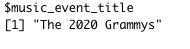

<style>
    pre code {
      white-space: pre-wrap;
    }
</style>

```{r setup, include=FALSE}
knitr::opts_chunk$set(echo = FALSE)

# Learn more about creating blogs with Distill at:
# https://rstudio.github.io/distill/blog.html

```

```{r include=FALSE}
library(knitr)
library(jpeg)
```

The next topic I learned about in the DataQuest Data Analyst in R track is a list. I decided that in honor of music’s biggest night, also known the Grammys that took place last night, the examples in this post are going to be music focused. So without further ado, let’s get it started!

DataQuest defines lists as specialized vectors that contain multiple types of objects. These objects can be different data structures including single data elements, vectors, and matrices. So why lists? Storing objects in lists allow me to make use of some of R’s features for performing the same operation on each object in the list. The list is created using the list() function, like so:

```{r echo=TRUE}
music_genres <- list("jazz", "reggae", "pop", "hip hop", "R&B", "rock", "country")
music_genres
```

Note that the numbers one through seven tell you the order of the objects stored in this list.

To give you a better idea of how lists in R work, I’ll give another example. In this example, I have some data gathered for the Grammys. I want to store this information in a list.

```{r echo=TRUE}
music_event_title <-c("The 2020 Grammys")
music_event_description<-c("Music's biggest night!")
music_event_location<-c("Los Angeles", "Staples Center")
music_event_day<-c("Sunday")
music_event_time <-c("8:00 pm Eastern", "5:00 pm Pacific")
big_categories<-c("Album of the Year", "Song of the Year", "Record of the Year", "Best New Artist")
winners<-c("Billie Ellish", "Nipsey Hussle", "Lizzo", "Tyler the Creator", "Beyonce", "PJ Morton")
performances<-c("Ariana Grande", "Demi Lovato", "Usher","Nipsey Hussle Tribute", "Gary Clark Jr", "Nas", "Lil Nas X" )
most_nominations<-c(12, 11, 10, 9)

music_event_meeting <-rbind(music_event_day, music_event_time)
music_event<-list(music_event_title, music_event_description, music_event_location, music_event_meeting, big_categories, winners, performances, most_nominations)
```

I call this element music_event which will give me a list that looks like this.

```{r echo=TRUE}
music_event
```

## Naming Lists

Similar to naming elements in a vector, I can assign names to objects in a list using the **names()** function.

```{r echo=TRUE}
music_event_names<-c("music_event_title", "music_event_description", "music_event_location", "music_event_meeting", "big_categories", "winners", "performances", "most_nominations")
names(music_event)<-music_event_names
```

Once again, I’ll call **music_event** and my list’s elements will have names.

```{r echo=TRUE}
music_event
```

If you call the names() function in a list without assigned names, the function will return **NULL**. This also applies to vectors.

## Indexing Lists
 Just as I did with vectors and matrices, I can also index lists. DataQuest tells me there are two different indexing operations used on lists:

- single brackets to return a list of selected elements []
- double brackets to return a single element [[]]

For example, I want to extract the third object in my list. I would type the following:

```{r echo=TRUE}
music_event[3]
```

```{r echo=TRUE}
typeof(music_event[3])
```

Note that in this example, I use the **typeof()** function. This function allows me to check the data type of an object. When I checked the data type for this object, I see that it is a list.

I could also use the following methods to return a list of selected items.

```{r echo=TRUE}
music_event["music_event_location"]
```

```{r echo=TRUE}
music_event[c(1,3)]
```

Now I’m going to use double brackets to return a single element. Again, I want extract the third object in my list. I’ll do the following:

```{r echo=TRUE}
music_event[[3]]
```

```{r echo=TRUE}
typeof(music_event[[3]])
```

Note that when using the typeof() function to check the data type of this object, I see that it is a character data type.

I could also use the following ways to return a single element.

```{r echo=TRUE}
music_event[["music_event_location"]]
```

```{r echo=TRUE}
music_event$"music_event_location"
```

To return a value contained in a list element, I could do this:

```{r echo=TRUE}
music_event[[c(3,2)]]
```

## Manipulating Lists

### Modifying List Elements

I can index lists to change specific list elements. Recall the element in **music_event_title:**

```{r, out.width= "40%"}

```

As you can see the “The 2020 Grammys” is the element in music_event_title. I want to change this element to the official title of the Grammys ceremony. I would write it like this:

```{r echo=TRUE}
music_event[[1]] <- "The 62nd Annual Grammy Awards"
music_event
```

I would first index the element I want to replace, then type its replacement. When I called the music_event list, you can see that the title has changed.

Let’s do another example. Let’s look at the **performances** element.

```{r, out.width= "80%"}

```

Let’s say I wanted to replace Demi Lovato with H.E.R. I would write the following:

```{r echo=TRUE}
music_event[[c(7.2)]] <- "H.E.R."
music_event[7]
```

## Adding Elements to a List

I could also add elements to a list. Let’s say I wanted to add an historic event that took place at last night’s Grammys. I can create an element called **music_event_history** add it to my list. When I call the music_event list, the new element is added.

```{r echo=TRUE}
music_event_history <-c("Billie Ellish is the youngest person to take home awards in each of the four major categories.")
music_event[[9]] <- music_event_history
music_event
```

I could also do it this way and get the same result.

```{r echo=TRUE}
music_event[["music_event_history"]] <-c("Billie Ellish is the youngest person to take home awards in each of the four major categories.")
music_event
```

## Combining Lists

I can combine lists too. Let’s recall the two lists I made earlier.

```{r echo=TRUE}
music_genres <- list("jazz", "reggae", "pop", "hip hop", "R&B", "rock", "country")

music_event<-list(music_event_title, music_event_description, music_event_location, music_event_meeting, big_categories, winners, performances, most_nominations)
```

When I combine the lists, I can see that the lists objects are combined into one list.

```{r echo=TRUE}
music_night <-c(music_genres, music_event)
music_night
```

## Nested Lists

Finally for this post, I’ll cover nested lists. Nested Lists are lists inside of lists. Let’s take the previous example. What if instead of combining lists, I want to create a lists of lists. I would write:

```{r echo=TRUE}
grammy_night_list <- list(music_genres= music_genres, music_event = music_event)
grammy_night_list
```

This resulting list contains my two lists, **music_genres** and **music_events** as objects.

This concludes my lesson in lists in R! I had a lot of fun using Grammy data for this post. Until next time..