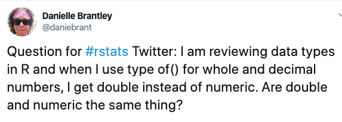

```{r setup, include=FALSE}
knitr::opts_chunk$set(echo = FALSE)

# Learn more about creating blogs with Distill at:
# https://rstudio.github.io/distill/blog.html

```
For this post, I’ll discuss the working with vectors lesson on DataQuest’s Data Analyst in R track. I’m going to dive deeper into vectors, talking about indexing in R and R’s different data types. There was so much that I learned in this lesson that I decided to break this topic up into two posts. So let’s jump right in!

As mentioned in my last post, vectors are storage objects that stores a sequence of values. Vectors can be indexed to select the subset of elements they contain. Each element of a vector is assigned a position. This reminds me of lists in Python with one key difference. R is an 1-indexed programming language so the first element in a vector is assigned the position of one. This is very different from what I learned in Python or JavaScript where indexing starts at zero. I think it’s a bit easier though because when we count we usually start from one.

## Indexing By Position
You can *index vectors by position* using a single element, a range of elements or multiple elements. Let’s take the example vector from my previous Intro To R Programming post.

```{r}
tea_price <- c(5, 4, 2, 2, 3)
```

### Index Using a Single Element:

```{r echo=TRUE}
tea_price[2]
```

### Index by Range of Elements:

```{r echo=TRUE}
tea_price[2:4]
```

### Index Using Multiple Elements:

```{r echo=TRUE}
tea_price[c(1, 3, 5)]
```

## R’s Data Types

Like other programming languages, R also has data types. In this lesson, DataQuest presents three basic data types:

**Numeric(Double)**– consists of numbers( 4, 32.6, 32.67521, -2 , -7.9)

**Character**– consists of letters, numbers and special characters. Character data is surrounded by quotation marks (“snake”, “&”, “%” , “special0964”, “cool + beans”)

**Logical**-stores boolean values TRUE and FALSE

To find out the type of data type I’m working with, I learned to use **typeof()** function.

This is where things got a bit confusing for me. I decided to try this for myself in both R Studio and the R console that comes with R. I ended up with the following:

```{r echo=TRUE}
typeof(88)
typeof(6.7)
typeof(-0.75)
typeof(-4.93)
typeof(47)
typeof(392)
typeof(9.6666667)
```

As you can see when I use the typeof() function on both whole numbers and decimals, it doesn’t come back as numeric, it comes back as double. From the lesson, I understood double to mean just decimal numbers.

I decided to consult the #rstats community on Twitter.



A few members of the #rstats community, Maarten Demeyer, Tyson Barrett, and Colin Fay came through with helpful responses that helped clarify the confusion I had. A special thank you to them! Check out their responses here.

What I gathered from these responses and further research is that numeric is a class and the double data type fall into that class. There are also more data types in R but I won’t get into those right now.

## Names() Function

I also learned that in R you can assign names to vector elements. To do this, we use the **names()** function. Again, taking the example from my Intro to R Programming post, if I wanted to assign the values contained in tea_flavors to the values stored in tea_prices, it would look like this:

```{r echo=TRUE}
tea_flavors <- c("chai", "matcha", "black", "green", "white")
tea_prices <- c(5, 4, 2, 2, 3)
names(tea_prices) <- tea_flavors
tea_prices
```

I could also use the names() function to return the names of the elements in a vector like this:

```{r}
names(tea_prices)
```

## Indexing By Name
Lastly for part one, I’ll talk about indexing by name. In R, you can *index vectors by name*. Note that I get the same result when I index by name and position.

```{r echo=TRUE}
tea_prices["matcha"]
tea_prices[2]
```

Earlier in this post you saw how I indexed by position using multiple elements. You can do the same when indexing by name.

```{r echo=TRUE}
tea_prices[c("black", "white")]
```

Whew, that was a lot to cover! That’s it for Part One working with vectors. Part Two is coming soon!