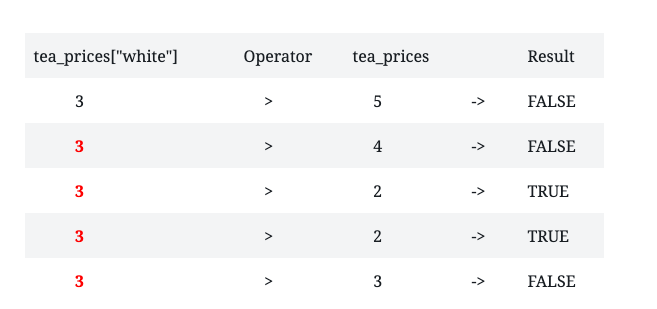
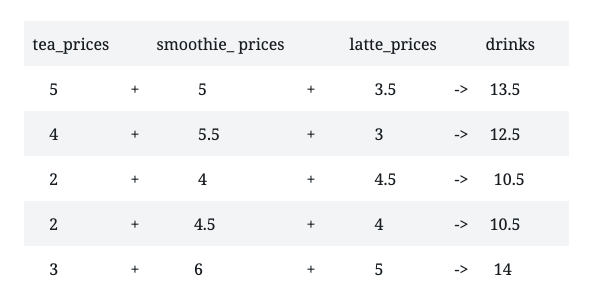
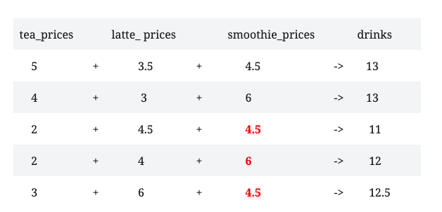

```{r setup, include=FALSE}
knitr::opts_chunk$set(echo = FALSE)

# Learn more about creating blogs with Distill at:
# https://rstudio.github.io/distill/blog.html

```

This post is a continuation of what I learned in the DataQuest lesson, Working with Vectors. If you want to read part one, click here.

## Logical Operators

Like many other programming languages, R uses comparison operators, also known as logical operators to compare values. When comparing two values, both values must satisfy the condition for the R interpreter to return **TRUE**. If the values do not satisfy the condition, the R interpreter will return **FALSE**.

The logical operators are:

**Greater than:** >

**Less than:** <

**Greater than or equal to:** =>

**Less than or equal to:** <=

**Equal to:** ==

**Not equal to:** !=

The TRUE and FALSE values are another data type in R called logical. The logical data type only consists of values TRUE and FALSE.

For an example, let’s continue with the tea example from the last post and introduce a new vector, the smoothie_prices vector. If I take the average value of tea_prices and compare it to the average value of smoothie_prices, I’ll get the following below:

```{r echo=TRUE}
tea_flavors <- c("chai", "matcha", "black", "green", "white")
tea_prices <- c(5, 4, 2, 2, 3)
names(tea_prices) <- tea_flavors
smoothie_prices <-c(5, 5.5, 4, 4.5, 6)
mean(tea_prices) < mean(smoothie_prices)
```

## Comparing Single Values Against Vectors

I’ll use an example from my previous post. These are the tea flavors and their prices below.

```{r echo=TRUE}
tea_prices
```

If I want to compare the price of white tea to the prices of the other teas, the syntax would look like this:

**tea_prices[“white”] > tea_prices**

Let’s see what happens when I type the above expression in the R interpreter.

```{r echo=TRUE}
tea_prices["white"] > tea_prices
```

An important concept in R is understanding how R works with vectors of different lengths. When comparing a vector that contains a single value to a vector that contains multiple values, R replicates the shorter vector until it is the same length as the longer vector. In DataQuest, they break down their example into a table so that it is easier for students to understand. I’ll do the same here because this is what made me better understand what happened in the interpreter.



When I compare the price of white tea(a vector containing a single value) to the vector containing the all the tea prices, R replicated the price of the white tea until it became the same length as the tea_prices vector.  We will revisit this concept later on.

Logical data can also be stored in vectors. Let’s say I wanted to store the results of comparing the price of white tea to the other teas, I can write the following:

```{r echo=TRUE}
compare_teas <- tea_prices["white"] > tea_prices
```

If I use the typeof() function to check the data type of the compare_teas vector, I get:

```{r echo=TRUE}
typeof(compare_teas)
```

## Logical Indexing

Now that I’ve learned how to index by position and name, I was introduced to a new type of indexing called logical_indexing. DataQuest gives a great explanation of logical indexing:

>"Logical indexing will compare each value in a target vector against the
>
>corresponding value in a logical vector. If the corresponding value is TRUE, the
>
>resulting vector will contain that value. If the corresponding value is FALSE, the
>
>resulting vector will not contain that value.”

For example, if I wanted to create a new vector containing only the teas whose prices are greater than price of the white tea, I would write:

```{r echo=TRUE}
above_tea_prices <- tea_prices > tea_prices["white"]
tea_prices[above_tea_prices]
```

## Performing Arithmetic On Vectors

I learned that I could add, multiply or divide vectors. Let’s look at the example below:

```{r echo=TRUE}
tea_prices <- c(5, 4, 2, 2, 3)
smoothie_prices <- c(5, 5.5, 4, 4.5, 6)
latte_prices <- c(3.5, 3, 4.5, 4, 5)
drinks <- (tea_prices + smoothie_prices + latte_prices)
drinks
```

```{r echo=TRUE}
drinks <- (tea_prices + smoothie_prices + latte_prices)/3
mean(drinks)
```

Notice that when I added the prices of the teas, smoothies and lattes in a vector called drinks, I got a vector containing five values. According to DataQuest, this is what is known as vector arithmetic. When performing arithmetic on vectors, operations are performed between values in order of position. When I added all the drink prices together, this is how the operation was performed:   



The ability to perform arithmetic operations on every element of multiple vectors at once is a very powerful feature of R. 

## Vector Recycling

I talked a bit earlier about vector recycling. To recap when there’s a mismatch in the length of the two vectors being compared, R repeats or recycles the shorter vector until it matches the length of the longer vector. For this next example, I shortened the length of the smoothie_prices vector. However, when I did the addition, I got this warning message.

```{r echo=TRUE}
tea_prices <- c(5, 4, 2, 2, 3)
smoothie_prices <- c(4.5, 6)
latte_prices <- c(3.5, 3, 4.5, 4, 5)
drinks <- (tea_prices + smoothie_prices + latte_prices)
```

This message alerts me of the possibility that the different vector lengths were not intended. When I call the drinks vector, the operation is still performed. I also took the average of the prices in the drinks vector.

```{r echo=TRUE}
drinks
```

```{r echo=TRUE}
mean(drinks)
```



The values highlighted in red represent the recycled values of the smoothie_prices vector. The problem with vector recycling is that although R recycled the incomplete smoothie_prices vector and calculated the average price of a drink, the average is not accurate. The average is not accurate because some of the elements of the smoothie_prices vector are missing. This brings me to the last topic for this post. 

## Appending Elements To A Vector

Let’s say I wanted to add the other prices to the smoothie_prices vector. I could add or append values to the smoothie_prices vector. Let’s look at this example:

```{r echo=TRUE}
smoothie_prices <- c(4.5, 6)
smoothie_prices <- c(smoothie_prices, 4, 5, 5.5)
smoothie_prices
```

I used the **c() function** to create a new vector consisting of the existing vector plus the new elements I want to add. I don’t know about you, but this is much better than retyping the smoothie_prices vector.

And on that note, this wraps up part two of what I learned about vectors in R! My next post will introduce a brand new topic!