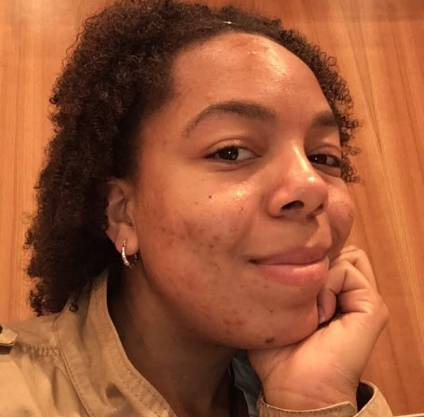

```{r setup, include=FALSE}
knitr::opts_chunk$set(echo = FALSE)
```

```{r include=FALSE}
library(knitr)
library(jpeg)

```

```{r, out.width= "50%"}

```
```{css, echo=FALSE}
img {
  border-radius: 50%;
  display: block;  
  margin-left: auto;  
  margin-right: auto; 
}

```

For years, I have been interested in data science. I finally decided to pursue it and be intentional about it. I wanted to start writing about my passions, my thoughts, and curious wonderings about the world of data science. Data Sci Dani is a space where I’ll share my projects and what I’m learning, giving you insight into my skillset. 

In my free time, I’m listening to 90s Hip Hop and R&B, obsessing over podcasts or watching hair and makeup tutorials on YouTube. I’m also trying to keep with the latest trends in media.

Take some time to explore the blog, read something interesting, and feel free to reach out.